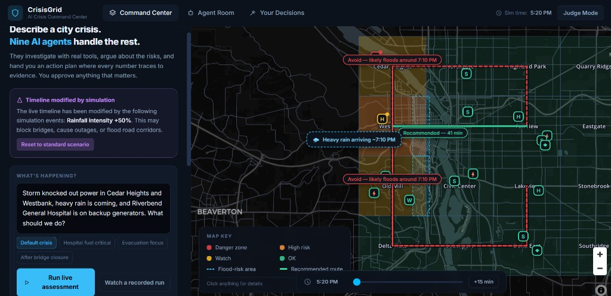
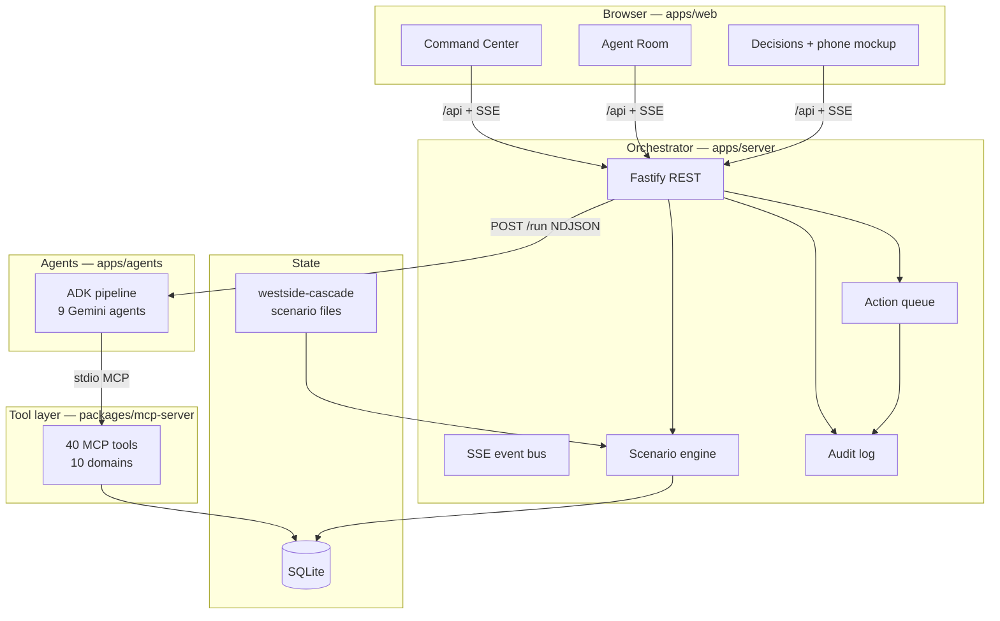
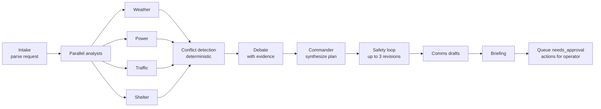
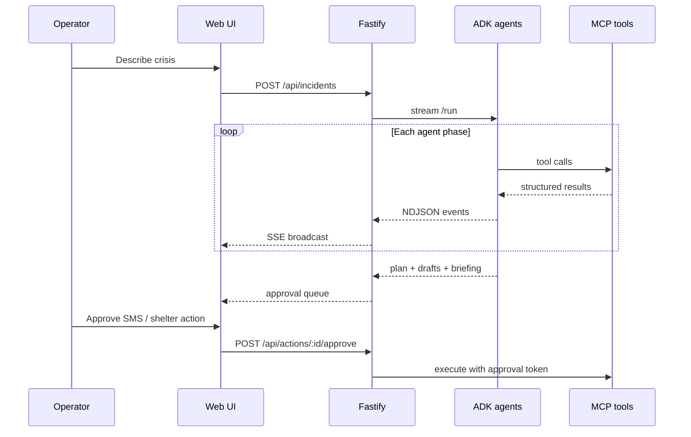
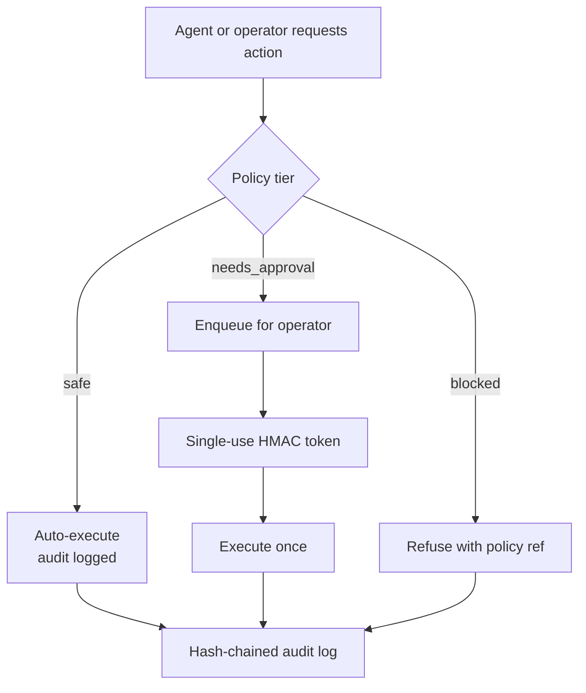

<p align="center">
  
</p>

<h1 align="center">CrisisGrid</h1>
<p align="center"><strong>AI Crisis Command Center</strong></p>
<p align="center">Describe a city crisis in plain English. Nine agents investigate, argue, and hand you a plan you can actually approve.</p>

---

## What this is

CrisisGrid is a simulated emergency operations dashboard for a fictional Portland-area city. You type what’s going wrong : power out, hospital on generators, storm incoming  and a team of Gemini agents pulls real numbers from a shared tool layer, catches each other’s mistakes, and queues the consequential actions for **you** to sign off.

Nothing goes to real residents. Alerts land in a sandbox phone mockup. Dispatch is blocked by policy. Every claim is supposed to trace back to a tool call, not vibes.

Built for an agentic-AI hackathon demo: Google ADK agents, a 40-tool MCP server, a deterministic city engine you can fork for what-ifs, and 47 automated evals.

---

## The three screens

| Screen | What you do there |
|--------|-------------------|
| **Command Center** | See the map, describe the crisis, run a live assessment or replay a recorded run, try what-if forks |
| **Agent Room** | Watch nine agents work in parallel — findings, conflicts, debate, safety revisions, executive summary |
| **Your Decisions** | Approve or reject queued actions, preview SMS in a phone mockup, download the handoff report |

**Judge Mode** (top right) opens the rubric drawer: architecture notes, MCP tool catalog, safety tiers, eval summary.

---

## Architecture

Three runtimes, one product. The browser never talks to Gemini directly.



**Why it’s split this way**

- **React UI** — MapLibre map, live feed, approval UX. Reads humanized labels, not raw zone IDs.
- **Fastify server** — Owns the database, scenario ticks, action queue, and the SSE stream the UI watches.
- **Python ADK service** — Runs the agent graph. Calls tools only through MCP (eval-enforced).
- **MCP server** — The only path agents have to city data. Same choke point for operator-approved actions.

---

## Assessment pipeline

One operator message kicks off the full run. Domain analysts work in parallel; conflicts are detected in **code**, not by asking another LLM “did they disagree?”





---

## Safety model (structural, not prompt-based)

Policy is enforced where tools execute — not buried in system prompts.



Public alerts, shelter assignments, and live scenario injections sit in **needs_approval**. Real dispatch and mass broadcast are **blocked**.

---

## What-if simulations

The left panel can fork the city engine without mutating the live timeline — bridge closed, heavier rain, outage spreading east. The map shows a purple overlay on affected neighborhoods; risk deltas appear in the panel. **Apply to live situation** commits the fork so a new assessment runs against the updated world.

Replay mode plays back a **recorded** pipeline run with original timing, labeled honestly. It does not fake a live run when agents are offline.

---

## Quick start

**Prereqs:** Node 20+, Python 3.11+, pnpm

```bash
pnpm install

# Python agents (once)
python -m venv apps/agents/.venv
apps/agents/.venv/Scripts/pip install google-adk mcp fastapi "uvicorn[standard]" httpx pydantic   # Windows
# source apps/agents/.venv/bin/activate && pip install ...                                         # macOS/Linux

cp .env.example .env   # add GOOGLE_API_KEY
pnpm dev
```

Open **http://localhost:5173**

Boot health should report API, agents, and web all OK. Live assessment needs `GOOGLE_API_KEY`; **Watch a recorded run** works without it.

---

## 90-second demo script

1. **(0:00)** Command Center — red zones on the map, hospital on backup power, click anything for the inspector.
2. **(0:15)** Hit **Run live assessment** with the pre-filled storm scenario (or a preset chip).
3. **(0:20)** Agent Room — nine tiles, parallel tool calls, findings streaming in.
4. **(0:45)** Conflict caught (e.g. evacuation route vs flood timing) — agents debate with evidence chips.
5. **(1:05)** Safety forces a plan revision — real critique loop, not theater.
6. **(1:20)** Decisions — approve the SMS; it appears on the sandbox phone mockup.
7. **(1:30)** Judge Mode — MCP catalog, tiers, eval count.

Bonus: try a **what-if** on the Command Center, apply it, re-run with the “After bridge closure” preset.

---

## Deploy (Docker monolith)

Single container: Fastify + Python agents + built React app. Good for Railway, Render, or Fly.

```bash
# Local smoke test
docker build -t crisisgrid .
docker run --rm -p 5173:5173 -e GOOGLE_API_KEY=your_key crisisgrid
```

Or, after `npx @railway/cli login`:

```bash
node scripts/deploy-railway.mjs
```

Set `GOOGLE_API_KEY` on the host (not in git). The platform’s `PORT` is mapped to the web UI automatically.

---

## Repo map

| Path | Role |
|------|------|
| `apps/web` | React + Vite + MapLibre command center |
| `apps/server` | Fastify API, SSE, scenario engine host |
| `apps/agents` | Google ADK agent service (Python) |
| `packages/mcp-server` | 40 tools, tier enforcement, stdio transport |
| `packages/engine` | Deterministic simulation + what-if forks |
| `packages/shared` | Shared schemas and policy rules |
| `packages/cli` | Headless `assess`, `actions`, `report` |
| `scenarios/westside-cascade` | City geometry, timeline, what-if events |
| `evals/ts` | 47 Vitest evals |
| `docs/images/` | Screenshots for docs |

---

## Evals

```bash
pnpm evals
```

Covers determinism, geo schema, policy tiers, approval gate, audit chain, tool catalog integrity, and the rule that agents must not bypass MCP.

---

## Data honesty

Geography uses real Portland-area coordinates. Grid, traffic, shelter, and facility status are **simulated scenario data** for a deterministic exercise. Weather can pull from Open-Meteo with source labels. No real emergency systems are connected.

---

<p align="center">Simulated exercise only. No real alerts, dispatch, or resident data.</p>
