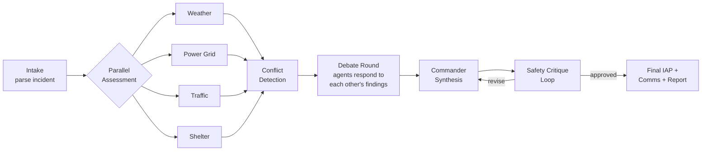

# 01 — Product Strategy & Winning Differentiation

## 1. What typical hackathon winners look like

Recent winning AI-agent projects share a recognizable profile:

| Trait | Typical winner | Typical also-ran |
|---|---|---|
| Agent count | 3–6 agents with distinct roles | 1 agent with 5 prompts |
| Collaboration | Sequential pipeline, sometimes one critique pass | Concatenated outputs |
| Tools | 5–15 tools, some real APIs | Mocked functions returning strings |
| Data | One real API + hardcoded JSON | Entirely fabricated |
| Demo | One happy-path flow | Chat transcript screenshots |
| Safety | A disclaimer paragraph | Nothing |
| Artifacts | A generated document or dashboard | Log output |
| Evals | Rare — this is a differentiator gap | None |

## 2. How CrisisGrid matches or exceeds each axis

### Multi-agent depth — exceeds
Typical winners run agents in a pipeline. CrisisGrid runs a **four-phase collaboration protocol**:

The debate round is the differentiator: agents receive *each other's findings* and must confirm, contest, or amend — producing on-screen disagreement (e.g., Traffic proposes Route 12; Weather flags Route 12 flood risk at T+45min; Commander selects Route 8 with cited trade-off). Judges see *why* multi-agent matters, not just that it exists.

### Real-world impact — exceeds
Emergency management is a real, funded, high-stakes domain. The output artifact (an ICS-inspired Incident Action Plan with objectives, assignments, comms plan, and operational period) mirrors documents real EOCs produce. The pitch writes itself: minutes saved in the first hour of a crisis save lives.

### Demo memorability — exceeds
Three built-in "wow" moments, each rehearsable and deterministic:
1. **The debate** — agents visibly disagree and the Commander arbitrates with evidence.
2. **The what-if** — "What if the bridge closes and rain intensifies?" → the plan visibly re-forms with a red/green diff.
3. **The block** — an agent tries to publish an alert; the Safety Agent blocks it; the operator approves a revised draft; the audit log records everything.

### Technical complexity — exceeds
- ~35 MCP tools across 9 namespaces with Zod-validated I/O
- Deterministic scenario engine with time-tick simulation and event injection
- Geospatial risk overlay computation (zone risk scoring from 6 weighted factors)
- Plan diffing engine for what-if comparison
- 16-category eval suite in CI
- Live map with real OSM basemap + synthetic overlay layers

### Useful output artifacts — exceeds
- Downloadable markdown incident brief with evidence, timestamps, assumptions, approvals, and blocked actions
- Public alert drafts (SMS / social / email variants)
- Internal operations update
- What-if comparison report
- Audit log export

## 3. Judging strategy per category

### Pitch — Core Concept & Value (10 pts)
Lead with the human problem: *"In the first 60 minutes of a cascading crisis, operators drown in siloed data. CrisisGrid turns one sentence into a coordinated, evidence-backed action plan."* Show the before/after: 6 phone calls and 5 dashboards → one command center.

### Pitch — YouTube Video (10 pts)
Structure (script in `02-demo-scenario.md` §7): problem (45s) → why agents (30s) → architecture diagram walkthrough (60s) → live demo of the 6 demo beats (3.5 min) → build tools incl. Antigravity + deploy (45s). Under 7 minutes total.

### Pitch — Writeup (10 pts)
The repo README (structure in `03-architecture.md` §10) covers goal, architecture, setup, agent roles, tools, limitations, and future work. Limitations are stated honestly (synthetic grid data, simulated dispatch) — honesty scores better than overclaiming.

### Implementation — Technical (50 pts)
Every checklist item is architected in, not bolted on: multiple specialized agents (9), real tool calls (MCP, logged and displayed), non-trivial workflows (debate + critique loop + what-if), realistic data (real weather + seeded geospatial city), no exposed keys (server-side env only), organized monorepo, safety logic (3-tier action classification).

### Implementation — Documentation (20 pts)
README + `/docs` with architecture diagrams (mermaid), screenshots, demo script, eval results table, security/privacy notes. All planned in docs `03` and `10`.

## 4. What we deliberately do NOT build

Scope discipline is part of the strategy:

- **No real dispatch integrations** (CAD, E911) — blocked tier, simulated only.
- **No user accounts/auth beyond a demo operator role** — not judged, wastes days.
- **No mobile app** — the dashboard is the product.
- **No training/fine-tuning** — prompt + tool engineering only.
- **Voice mode (P2)** — only if all P0/P1 done with ≥1 day remaining.
- **Real-time social media ingestion** — simulated 311/social feed only (P1, cuttable).

## 5. The one-sentence positioning for judges

> "CrisisGrid is what happens when you give a city's emergency operations center a staff of nine tireless domain experts who read all the data, argue about the best plan, show their evidence, and never act without human approval."
