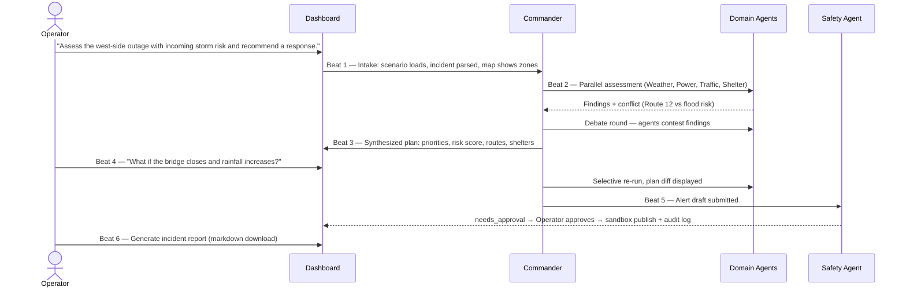

# 02 — Core Demo Scenario & Demo Script

Everything in the product is built around **one deterministic, replayable scenario**. This document defines it precisely so the scenario engine (`07-scenario-engine.md`) and seed data (`06-data-strategy.md`) can be generated from it.

---

## 1. The demo city: "Riverbend"

A fictional but geospatially realistic mid-size city (~480,000 population). Built on real coordinates (use the road network and geography of a real city — recommended: **Portland, OR bounding box** for OSM data richness, renamed "Riverbend" in the UI with a clear "simulated city based on open map data" label).

City structure (all defined in seed data):

- **16 zones** (`Z-01` … `Z-16`) in a 4×4 logical grid over the bounding box, each with population, density, and vulnerability index (elderly %, medical-device dependency, non-English %, mobility limitations).
- **A river** running north–south splitting west zones (Z-01, Z-05, Z-09, Z-13) from the rest, crossed by **3 bridges** (Cedar Bridge — north, Main St Bridge — central, Delta Bridge — south).
- **4 substations**: SUB-W1 (feeds Z-01, Z-05), SUB-W2 (Z-09, Z-13), SUB-C1 (center zones), SUB-E1 (east zones).
- **3 hospitals**: Riverbend General (Z-05, 420 beds, backup generator 8h fuel), St. Anne's (Z-07), Eastside Medical (Z-11).
- **6 shelters** with capacities: Lincoln HS (450), Westside Community Ctr (300), Fairgrounds Pavilion (800), Central Library (150), Northgate Church (200), Delta Rec Ctr (350).
- **28 signalized intersections**, 6 of which are in west zones.
- **12 resource units**: 4 utility crews, 3 bus groups (40 pax each), 2 portable generators, 2 pump crews, 1 mobile command unit.
- **Flood-risk polygons** along the river (100-year floodplain approximation covering parts of Z-05, Z-09, and Route 12).

## 2. Scenario: "Westside Cascade" — initial state (T+0)

Simulated clock starts **17:20 local, weekday (rush hour)**.

| Signal | State at T+0 |
|---|---|
| Power | SUB-W1 offline (storm-damaged feeder). Z-01 and Z-05 dark: ~61,000 customers. |
| Weather | Active storm cell WSW of city. Heavy rain (25–35 mm/h) forecast to reach west side at **T+110min**. Wind gusts 65 km/h. |
| Traffic | Rush hour baseline 78% congestion in west corridors. Signals dark at 6 west-side intersections → intersections at 4-way-stop, throughput −40%. |
| Hospital | Riverbend General on grid power **lost**, running on backup generator (8h fuel). In outage zone. |
| Evacuation | Route 12 (west river road, through floodplain) congestion rising: 62% → climbing. |
| Shelters | All open, aggregate occupancy 12%. |
| Population | Z-05 vulnerability index highest (elderly 22%, medical-device 4.1%). |

## 3. Scenario timeline (scripted event injections)

The scenario engine fires these at fixed ticks (1 tick = 5 simulated minutes). This exact table becomes `scenarios/westside-cascade/timeline.json`.

| Tick | Sim time | Event ID | Event |
|---|---|---|---|
| 0 | 17:20 | `EVT-001` | Scenario start: SUB-W1 offline, zones Z-01/Z-05 dark |
| 2 | 17:30 | `EVT-002` | Traffic sensor: Route 12 congestion 62% → 74% |
| 4 | 17:40 | `EVT-003` | Weather update: rain arrival revised to T+90min, intensity upgraded |
| 6 | 17:50 | `EVT-004` | Outage expands: SUB-W2 partial fault, Z-09 brownout |
| 8 | 18:00 | `EVT-005` | Riverbend General: backup generator fuel warning (est. 6h remaining) |
| 10 | 18:10 | `EVT-006` | Westside Community Ctr shelter reaches 60% capacity |
| 12 | 18:20 | `EVT-007` | 311 cluster: 40+ reports of flooding at Cedar & 5th (unverified) |
| 14 | 18:30 | `EVT-008` | Lincoln HS shelter reaches 90% capacity |

**What-if injections** (fired only on operator command, not on the timeline):

| Event ID | What-if |
|---|---|
| `WHATIF-BRIDGE` | Main St Bridge closed (inspection after debris strike) |
| `WHATIF-RAIN` | Rainfall intensity +50%, floodplain activation probability high |
| `WHATIF-OUTAGE-EAST` | Outage expands to Z-06 (east of river) |
| `WHATIF-SHELTER-FULL` | Lincoln HS at 100%, refuses new arrivals |

## 4. Expected agent findings (ground truth for evals)

These are the *correct* conclusions the agents should reach. They double as eval assertions (`10-evaluation-plan.md`).

1. **Weather**: heavy rain reaches west side in ~90 min; flood risk on Route 12 and Z-05/Z-09 floodplain becomes HIGH within 2h. Confidence high (forecast + floodplain overlay).
2. **Power**: Z-01/Z-05 outage is critical because Riverbend General is inside; restoration priority = SUB-W1 feeder to hospital circuit first, then signalized corridors, then residential. Generator fuel gives an 8h (later 6h) hard deadline.
3. **Traffic**: Route 12 is the fastest westside evacuation route *now* but crosses the floodplain — becomes unsafe before evacuation completes. Route 8 (inland, via Main St Bridge) is 6 min slower but flood-safe. Signal-dark intersections need portable stop control or officer dispatch (simulated).
4. **Shelter**: Z-05 vulnerable population (~2,900 people likely to need shelter) should map to Fairgrounds Pavilion (800 cap, east of river, powered) via Route 8, NOT to Lincoln HS (fills by 18:30). Stage buses at Westside Community Ctr.
5. **Cascade detection**: outage → dark signals → congestion on the only flood-safe route → evacuation bottleneck; hospital on finite fuel → restoration priority conflict with signal restoration. This chain must appear explicitly in the plan.
6. **Comms**: public alert advising Z-01/Z-05 residents about outage duration, shelter locations, Route 8 guidance; internal update to utility + traffic + shelter teams. Both require approval.

**Correct commander arbitration:** Route 8 over Route 12 (safety over speed, citing Weather evidence); hospital circuit over signal restoration for crew #1 (life-safety), signals for crew #2; pre-position buses before rain arrival (time-window reasoning).

## 5. What-if expected deltas (ground truth)

`WHATIF-BRIDGE` (Main St Bridge closes):
- Route 8 becomes unavailable → Traffic must re-solve: Delta Bridge route (+14 min) becomes primary.
- Shelter assignment flips: Delta Rec Ctr (south, 350 cap) takes priority over Fairgrounds for Z-13; Fairgrounds still serves Z-05 via Delta Bridge.
- Risk score rises (evacuation capacity reduced ~45%).
- New action: request bridge inspection ETA; stage pump crews near Delta approach.

`WHATIF-RAIN` (+50% intensity):
- Route 12 immediately flagged unusable (not just "risky").
- Floodplain zones Z-05/Z-09 risk → CRITICAL; evacuation timeline compresses from 2h to ~1h.
- Pump crews dispatched (simulated) to Cedar & 5th; Commander moves evacuation start earlier.

The plan-diff view must show: changed risk score, changed route, changed shelter allocation, new/removed/modified actions — each tagged with which agent's re-assessment caused it.

## 6. Demo flow storyboard (6 beats)

**Beat 1 — Crisis intake (30s).** Operator types the sentence. Intake Agent parses to a structured incident (shown as a card). Map zooms to west side, dark zones pulse, hospital and shelters light up as markers. Agent status board flips from idle to active.

**Beat 2 — Multi-agent analysis (60s).** Agent Room shows each agent's findings streaming in as structured cards with severity/confidence chips and evidence popovers. The conflict fires: Traffic proposes Route 12; Weather contests with the flood-timing evidence; the debate exchange is rendered as a threaded conversation.

**Beat 3 — Commander plan (45s).** The Incident Action Plan panel populates: immediate (15 min) / short-term (1h) / next operational period, with agencies, evacuation guidance (Route 8, with the trade-off explained), shelter staging, restoration priorities, unresolved risks, assumptions, confidence score. Risk score gauge shows 78/100 HIGH.

**Beat 4 — What-if (60s).** Operator triggers `WHATIF-BRIDGE` + `WHATIF-RAIN` from the simulator panel. Affected agents (Traffic, Weather, Shelter — not Power) re-run. Diff view: old plan vs new plan, changed lines highlighted, risk 78 → 91 CRITICAL, route flips to Delta Bridge, shelter allocation re-forms. Commander's change explanation displayed.

**Beat 5 — Approval & comms (45s).** Comms Agent's public alert draft appears in the Action Queue as `needs_approval`. Show one deliberately blocked action (e.g., "broadcast to all channels" → blocked, reason shown). Operator approves the SMS alert → publishes to the sandbox demo feed → audit log entry appears with timestamp, approver, and content hash.

**Beat 6 — Incident report (30s).** One click generates the incident brief: summary, timeline, agent assessments, approvals, blocked actions, what-if comparison, assumptions, next steps. Download as markdown. Scroll it on camera.

## 7. Video script outline (target ≤ 7:00)

| Segment | Time | Content |
|---|---|---|
| Problem | 0:00–0:45 | Cascading crisis montage; "operators drown in siloed data in the first hour" |
| Why agents | 0:45–1:15 | One model can't hold 6 domains + disagree with itself + gate its own actions. Show the collaboration diagram. |
| Architecture | 1:15–2:15 | Walk the architecture diagram: ADK agents → MCP server → real + scenario data; safety layer; eval suite |
| Demo | 2:15–5:45 | Beats 1–6 exactly as storyboarded above |
| Build & deploy | 5:45–6:45 | Antigravity/agent-assisted dev clip; `docker compose up` + Cloud Run deploy; CLI running evals green; security features (env handling, approval gates) |
| Close | 6:45–7:00 | Impact statement + limitations honesty ("simulated city, real weather, real map data") |

## 8. Rehearsal requirements

- The entire demo must run **offline** (scenario mode) — rehearse with network disabled once.
- Script every typed input; keep them in `docs/demo-script.md` in the repo for copy-paste.
- Record the demo segments *from the deployed instance*, not localhost, to prove deployability in the same footage.
- Have a fallback screen recording of every beat.
