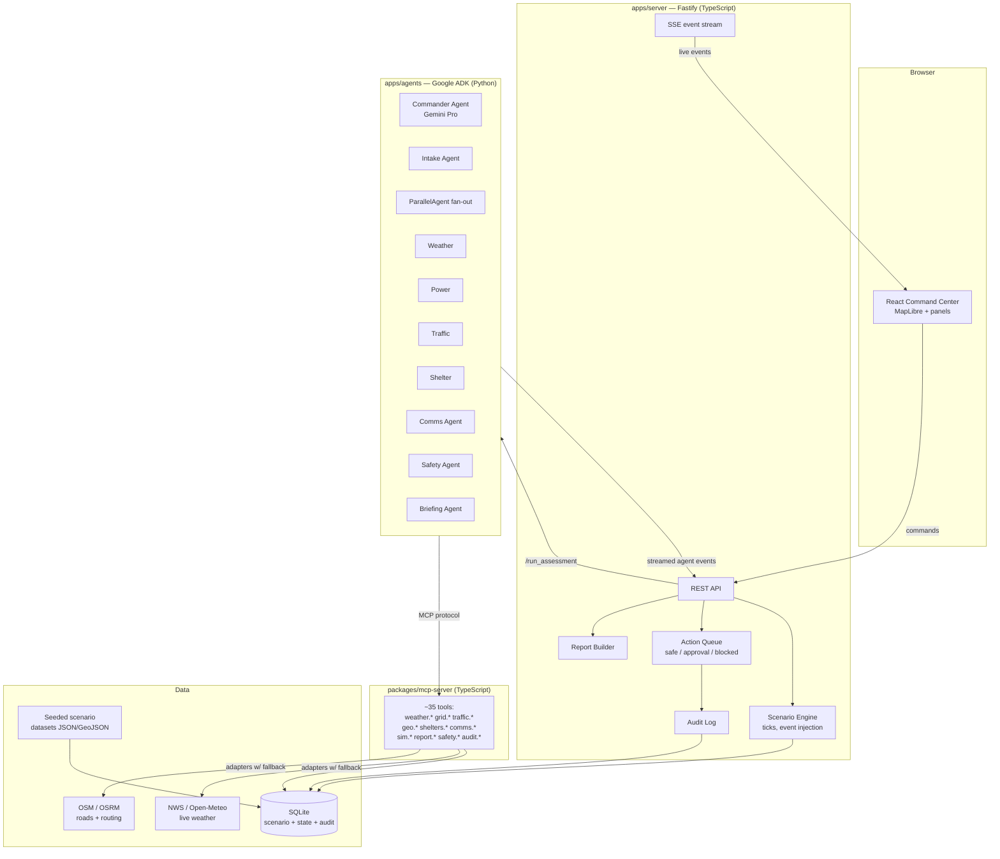
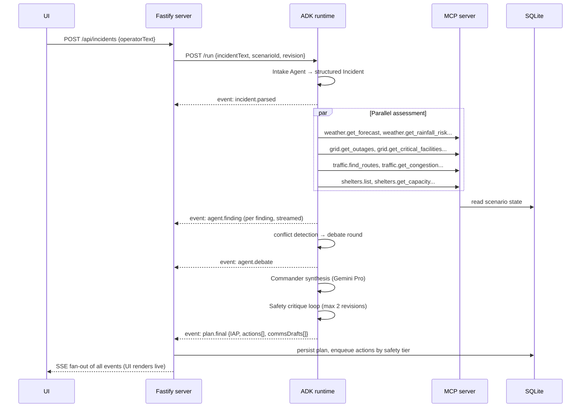

# 03 — System Architecture

## 1. Stack decision

| Layer | Choice | Why |
|---|---|---|
| Frontend | React 18 + Vite + TypeScript, Tailwind, MapLibre GL JS, Zustand | Fast build, MapLibre is free/keyless with open tiles, Zustand for live event state |
| API / Orchestration host | Node 20 + Fastify + TypeScript | Owns scenario engine, action queue, audit log, SSE stream to UI |
| Agents | **Python 3.11 + Google ADK** (`google-adk`) | ADK is the rubric item; Python is its first-class, best-documented runtime. Do not gamble on unofficial ports. |
| MCP server | TypeScript, `@modelcontextprotocol/sdk`, stdio + SSE transports | ADK's `MCPToolset` connects to it; also independently runnable/inspectable — proves "MCP server in code" |
| LLM | Gemini 2.x via ADK (Flash for domain agents, Pro for Commander) | Native ADK support; Flash keeps parallel fan-out fast/cheap |
| Persistence | SQLite (better-sqlite3 on Node side; read-only from MCP server) | Zero-ops, file-based, perfect for deterministic demo; schema portable to Postgres |
| Schemas | Zod (TS) + Pydantic (Python), generated from one JSON Schema source of truth in `packages/shared` | Both sides validate identical structures |
| Evals/tests | Vitest (TS) + Pytest (agent evals) | Runs in CI |
| Deploy | Docker Compose (demo) + Cloud Run (video's deploy segment) | Judges see one-command up + real cloud deploy |

**Polyglot note (important):** this is a *two-runtime* monorepo. Python only lives in `apps/agents`. Everything else is TypeScript. The seam between them is HTTP (server → agents) and MCP (agents → tools). This is deliberate: it demonstrates ADK and MCP as genuinely separate, interoperating systems — which is exactly what the rubric rewards.

## 2. System diagram



### Live operations extension

The same architecture supports a real-app mode without changing the agent contract. Live provider access belongs behind the server/MCP boundary, never in the browser. The web app should boot from server-owned snapshots (`/api/map/snapshot`, `/api/runtime`, `/api/sources`) and then update through `GET /api/events`. Provider adapters normalize live/manual/scenario data into a shared source metadata envelope before agents or UI components see it.

The detailed live-mode design is in `13-live-data-real-app-plan.md`.

## 3. The assessment lifecycle (core sequence)



Every `event:` line above is forwarded over SSE to the browser, which is what makes the Agent Room feel alive.

## 4. Monorepo folder structure

```
crisisgrid/
├── package.json                  # pnpm workspaces root
├── pnpm-workspace.yaml
├── docker-compose.yml
├── .env.example                  # ALL required vars, no values
├── README.md                     # the judged writeup (see §10)
├── docs/
│   ├── architecture.md           # diagrams (export from this plan)
│   ├── demo-script.md            # copy-paste demo inputs
│   ├── screenshots/
│   ├── evals.md                  # eval results table
│   └── security.md               # security & privacy notes
├── apps/
│   ├── web/                      # React + Vite command center
│   │   └── src/
│   │       ├── screens/          # Dashboard, Map, AgentRoom, ActionQueue,
│   │       │                     # WhatIf, Report, Timeline, Evidence
│   │       ├── components/       # map layers, cards, gauges, diff view
│   │       ├── state/            # Zustand stores fed by SSE
│   │       └── lib/sse.ts
│   ├── server/                   # Fastify orchestration host
│   │   └── src/
│   │       ├── routes/           # incidents, actions, whatif, reports, scenario
│   │       ├── scenario/         # engine: ticks, timeline, injections
│   │       ├── actions/          # queue, classification enforcement
│   │       ├── audit/
│   │       ├── reports/          # markdown assembly
│   │       ├── db/               # schema.sql, migrations, repositories
│   │       └── sse/
│   └── agents/                   # Python + google-adk
│       ├── pyproject.toml
│       └── crisisgrid_agents/
│           ├── main.py           # FastAPI wrapper: /run, /whatif, streaming
│           ├── commander.py      # root LlmAgent (Gemini Pro)
│           ├── intake.py
│           ├── domain/           # weather.py, power.py, traffic.py, shelter.py
│           ├── comms.py
│           ├── safety.py
│           ├── briefing.py
│           ├── workflows.py      # ParallelAgent, debate, critique LoopAgent
│           ├── schemas.py        # Pydantic models (generated)
│           └── mcp.py            # MCPToolset wiring (SSE to mcp-server)
├── packages/
│   ├── shared/                   # single source of truth
│   │   ├── schema/*.json         # JSON Schema for Incident, Finding, Plan, Action...
│   │   ├── src/zod/              # generated Zod
│   │   └── scripts/gen-pydantic.ts
│   ├── mcp-server/
│   │   └── src/
│   │       ├── index.ts          # stdio + SSE transports
│   │       ├── tools/            # weather.ts grid.ts traffic.ts geo.ts
│   │       │                     # shelters.ts resources.ts comms.ts
│   │       │                     # sim.ts report.ts safety.ts audit.ts
│   │       ├── adapters/         # nws.ts openMeteo.ts osrm.ts scenarioDb.ts
│   │       └── registry.ts       # tool metadata incl. safety tier
│   └── cli/                      # `crisisgrid` CLI (see §8)
├── scenarios/
│   └── westside-cascade/
│       ├── city.geojson          # zones, river, bridges
│       ├── facilities.json       # hospitals, shelters, substations, signals
│       ├── population.json
│       ├── timeline.json         # scripted events (doc 02 §3)
│       └── whatifs.json
└── evals/
    ├── fixtures/                 # ground-truth expectations (doc 02 §4–5)
    ├── ts/                       # Vitest: tools, schemas, safety, engine
    └── agents/                   # Pytest: agent-level evals
```

## 5. Event model (SSE)

All UI liveness comes from one SSE channel: `GET /api/events?incidentId=...`

| Event type | Payload | UI effect |
|---|---|---|
| `scenario.tick` | tick, simTime, changedEntities[] | timeline advances, map layers update |
| `scenario.event` | timeline event | toast + timeline marker |
| `incident.parsed` | Incident | incident card renders |
| `agent.status` | agentId, state (idle/running/done/error) | agent board chips |
| `agent.tool_call` | agentId, tool, argsSummary, resultSummary | tool-call feed (proof of real tool use) |
| `agent.finding` | Finding | finding card streams into Agent Room |
| `agent.debate` | round, from, to, stance, text, evidenceRefs | debate thread renders |
| `plan.final` | IncidentActionPlan | plan panel + risk gauge |
| `plan.diff` | PlanDiff | what-if comparison view |
| `action.queued/approved/blocked/executed` | Action | action queue + audit updates |
| `report.ready` | reportId, url | download button |

## 6. Persistence schema (SQLite)

Tables (columns abbreviated; full DDL written during M1):

- `scenarios(id, name, meta)` / `scenario_state(scenario_id, tick, entity_type, entity_id, state_json)` — current world state per tick
- `incidents(id, scenario_id, revision, operator_text, parsed_json, created_at)`
- `findings(id, incident_id, agent_id, finding_json, created_at)`
- `debates(id, incident_id, round, from_agent, to_agent, stance, text, evidence_json)`
- `plans(id, incident_id, revision, plan_json, risk_score, confidence)`
- `actions(id, plan_id, tier, status, payload_json, approved_by, approved_at, blocked_reason)`
- `audit_log(id, ts, actor, event_type, detail_json, content_hash)` — append-only
- `reports(id, incident_id, markdown, created_at)`
- `tool_calls(id, incident_id, agent_id, tool, args_json, result_digest, latency_ms, ts)` — powers the evidence UI and the "no bypass" eval

## 7. Why agents live behind the server (not called from the browser)

- API keys stay server-side only (rubric: security).
- The action queue can *enforce* tiers: the ADK output proposes actions; only the Node server executes them, and it refuses anything not approved. Safety is structural, not prompt-based.
- The scenario engine and agents share one clock and one DB, so replays are deterministic.

## 8. CLI (`packages/cli`) — rubric item "agent skills / CLI"

```
crisisgrid scenario load westside-cascade      # seed DB
crisisgrid scenario tick --to 8                # advance sim time
crisisgrid assess "Assess the west-side outage..."   # run full pipeline headless
crisisgrid whatif WHATIF-BRIDGE WHATIF-RAIN    # inject + re-plan, print diff
crisisgrid report --incident latest --out brief.md
crisisgrid evals                               # run full eval suite
crisisgrid mcp inspect                         # list tools + schemas from live MCP server
```

Show `crisisgrid evals` and `crisisgrid mcp inspect` in the video — 10 seconds each, high rubric value.

## 9. Deployment

**Local / judge-reproducible:**

```bash
cp .env.example .env   # add GOOGLE_API_KEY
docker compose up      # web :5173, server :8080, agents :8090, mcp :8100
pnpm cli scenario load westside-cascade
```

Compose services: `web` (static build served by Caddy/nginx), `server`, `agents`, `mcp-server`. SQLite volume mounted. Healthchecks on all services.

**Cloud (video segment):** Cloud Run services for `server`, `agents`, `mcp-server` (SSE transport), static site on Cloud Run or Firebase Hosting. Secrets via Secret Manager. One `deploy.sh` script; record it running.

**Demo mode flag:** `DEMO_MODE=true` forces all adapters to scenario data (fully offline). This is the mode used on stage.

## 10. Repo README outline (the judged writeup)

1. Hero screenshot + one-liner
2. Problem
3. Solution & why multi-agent (with collaboration diagram)
4. Architecture (diagram from §2)
5. Agent roster table → link to docs
6. MCP tool catalog summary
7. Data sources: what's real (NWS, Open-Meteo, OSM/OSRM), what's simulated (city, grid, shelters) — explicit honesty section
8. Setup (Docker + manual), .env.example walkthrough
9. Demo script
10. Evals: table of 16 categories with pass status
11. Security & responsible design
12. Limitations & future work
