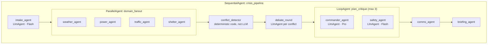

# 04 — Agent Architecture

Nine agents, implemented with Google ADK. This document is the implementation contract: for each agent — role, inputs, outputs, tools, prompt requirements, failure modes, and evals.

---

## 1. Shared output contract: the Finding

Every domain agent emits `Finding[]`. This is THE core schema of the product (JSON Schema lives in `packages/shared/schema/finding.json`; shown as Zod for readability):

```typescript
const Finding = z.object({
  id: z.string(),                          // "WX-001"
  agentId: z.enum(["weather","power","traffic","shelter","comms","safety","commander","intake","briefing"]),
  finding: z.string(),                     // one-sentence conclusion
  detail: z.string(),                      // 2-4 sentence explanation
  severity: z.enum(["info","low","medium","high","critical"]),
  confidence: z.number().min(0).max(1),
  evidence: z.array(z.object({
    kind: z.enum(["tool_call","dataset","assumption","agent_finding"]),
    ref: z.string(),                       // tool_call id, dataset key, or finding id
    summary: z.string(),
  })).min(1),                              // ← at least one evidence item, enforced
  recommendedAction: z.object({
    title: z.string(),
    description: z.string(),
    tier: z.enum(["safe","needs_approval","blocked"]),
    timeWindow: z.enum(["immediate","short_term","next_period"]),
    targetTeam: z.string(),                // "utility_ops", "traffic_control", ...
  }).nullable(),
  assumptions: z.array(z.string()),
  affectedZones: z.array(z.string()),      // ["Z-01","Z-05"]
  expiresAt: z.string().nullable(),        // sim-time validity (e.g., route safe until 18:50)
});
```

ADK enforcement: use `output_schema` on each `LlmAgent` with the Pydantic equivalent. A finding without evidence fails validation → the agent retries once with the validation error appended → if it fails again, emit an `agent.error` event (never silently drop).

## 2. Orchestration topology (ADK constructs)



Key decisions:
- **Conflict detection is code, not LLM**: after fan-out, a deterministic function finds contradictions — same zone/route/resource referenced by findings with incompatible recommendations or overlapping `expiresAt` windows. Each conflict spawns a debate exchange. This guarantees the debate fires in the demo (evals assert it fires on the seeded scenario).
- **Debate round**: for each conflict, the involved agents get a focused prompt: *"Agent X found [finding]. Your finding [id] conflicts because [reason]. Confirm, contest with evidence, or amend your finding."* Output: `DebateTurn {stance: confirm|contest|amend, text, evidenceRefs, amendedFinding?}`. One round only (two turns per conflict) — bounded cost/latency.
- **Critique loop**: Commander produces the plan → Safety Agent reviews → returns `approved` or `revisions[{issue, requiredChange}]` → Commander revises. `LoopAgent` max 3 iterations; if still unapproved, the plan ships with a visible `SAFETY_UNRESOLVED` banner and those items moved to blocked.
- **What-if runs** re-execute only affected agents (mapping in `07-scenario-engine.md` §5) and then re-run conflict → debate → critique.

## 3. Agent specifications

### 3.1 Intake Agent (`intake_agent`, Flash)
- **Role**: parse operator free text → structured `Incident`; ask ONE clarifying question only if location or incident type is truly missing (demo scenario never triggers this).
- **Inputs**: operator text, scenario clock, active scenario summary.
- **Tools**: `geo.geocode`, `sim.load_scenario`, `grid.get_outages` (to bind "west-side outage" to actual outage entities).
- **Output**: `Incident {id, types[], zones[], simTime, severityHint, constraints[], operatorIntent, clarificationNeeded?}`.
- **Failure modes**: hallucinated zone IDs (mitigate: validate against `geo.get_zone_boundaries`, reject unknown IDs); over-asking clarifications (prompt: "prefer reasonable assumption + record it in assumptions[]").
- **Evals**: 8 phrasing variants of the demo request all parse to types ⊇ {power_outage, storm} and zones ⊇ {Z-01, Z-05}.

### 3.2 Weather Hazard Agent (`weather_agent`, Flash)
- **Role**: hazard timing and escalation — rain arrival, intensity, flood risk overlay, wind risk.
- **Tools**: `weather.get_forecast`, `weather.get_alerts`, `weather.get_rainfall_risk`, `weather.get_wind_risk`, `geo.overlay_risk_layers`.
- **Output**: findings incl. time-to-impact per zone and per named route (must produce a Route 12 flood-window finding with `expiresAt`).
- **Failure modes**: vague timing ("soon") — prompt requires sim-time timestamps; confusing live vs scenario weather — tools return a `source: live|scenario` field the agent must copy into evidence.
- **Evals**: on seeded scenario, produces rain arrival T+90±15min, Route 12 flood risk HIGH within 2h, confidence ≥ 0.7.

### 3.3 Power Grid / Infrastructure Agent (`power_agent`, Flash)
- **Role**: outage scope, critical facility exposure, restoration priority queue.
- **Tools**: `grid.get_outages`, `grid.get_affected_zones`, `grid.get_critical_facilities`, `grid.estimate_restoration_priority`, `geo.find_nearby_facilities`.
- **Output**: findings incl. an ordered restoration priority list with reasons; hospital generator deadline finding (critical severity).
- **Failure modes**: missing the hospital (eval-guarded); inventing restoration ETAs — must come from `grid.estimate_restoration_priority`, evidence-linked.
- **Evals**: hospital circuit ranked #1; dark-signal corridors ranked above residential; generator deadline propagated as `expiresAt`.

### 3.4 Traffic & Evacuation Agent (`traffic_agent`, Flash)
- **Role**: congestion picture, route selection with hazard awareness, evacuation time estimates, signal-failure impact.
- **Tools**: `traffic.get_congestion`, `traffic.get_road_closures`, `traffic.find_routes`, `traffic.estimate_evacuation_time`, `geo.calculate_distance`.
- **Output**: ranked route candidates with ETA, capacity, hazard exposure; bottleneck findings.
- **Failure modes**: recommending fastest route while ignoring hazard overlays — the debate round is the systemic mitigation; also prompt requires listing hazard exposure per candidate route.
- **Evals**: proposes Route 12 as fastest AND flags/loses it after debate; recommends Route 8 in final plan; after `WHATIF-BRIDGE`, switches to Delta Bridge route.

### 3.5 Shelter & Resource Agent (`shelter_agent`, Flash)
- **Role**: shelter matching (capacity, power status, accessibility, travel time), resource staging (buses, generators, crews).
- **Tools**: `shelters.list`, `shelters.get_capacity`, `shelters.assign_population`, `resources.get_available_units`, `resources.recommend_staging`.
- **Output**: allocation plan `{zone → shelter, expectedLoad, route, transportNeed}` + staging recommendations.
- **Failure modes**: over-assigning beyond capacity (tool `shelters.assign_population` rejects overflow and returns remainder — agent must handle remainder, eval-checked); ignoring shelter power status.
- **Evals**: Z-05 → Fairgrounds (not Lincoln HS); total assigned ≤ capacity; buses staged before rain arrival.

### 3.6 Public Communication Agent (`comms_agent`, Flash)
- **Role**: draft public alert (SMS ≤ 320 chars, social, email variants) + internal ops update. Never sends anything — only drafts, all `needs_approval`.
- **Tools**: `comms.draft_public_alert`, `comms.draft_internal_update` (templating/validation tools), `safety.evaluate_action`.
- **Output**: `CommsDraft {channel, audience, urgency, body, factsUsed[], approvalRequired: true}`.
- **Prompt requirements**: only facts present in findings/plan; plain language; no casualty speculation; includes shelter addresses + route guidance; includes "this is a simulated exercise" watermark in demo mode.
- **Failure modes**: hallucinated facts (eval: every factual claim in the draft must map to a finding id — checked by an LLM-judge eval + string checks for numbers).
- **Evals**: SMS length limit; contains shelter name + Route 8; no unsupported numbers; tier is `needs_approval`.

### 3.7 Policy & Safety Agent (`safety_agent`, Flash)
- **Role**: critique the plan and classify every proposed action. Powers the critique loop and the action tiers.
- **Tools**: `safety.evaluate_action`, `safety.require_approval`, `safety.block_action`, `audit.log_event`.
- **Checklist enforced** (in prompt + deterministic post-check in code):
  1. every recommendation has evidence and confidence,
  2. no real-world dispatch/broadcast actions,
  3. evacuation guidance includes vulnerable-population handling,
  4. external comms flagged `needs_approval`,
  5. simulated actions labeled,
  6. uncertainty and unresolved risks section present.
- **Output**: `SafetyReview {verdict: approved|revise, revisions[], actionClassifications[]}`.
- **Failure modes**: rubber-stamping (eval: seeded "poison" plan with an unsafe action MUST be caught); over-blocking safe analysis actions.
- **Evals**: blocks `broadcast_all_channels` fixture; requires approval on all comms; approves the correct final plan within ≤3 loop iterations.

### 3.8 Commander / Orchestrator Agent (`commander_agent`, **Pro**)
- **Role**: synthesize all findings + debate outcomes into the Incident Action Plan; resolve conflicts explicitly; own the risk score narrative.
- **Tools**: `sim.compare_response_plans` (for what-if), `report.generate_action_plan`, `safety.evaluate_action`.
- **Output** — `IncidentActionPlan`:

```typescript
const IncidentActionPlan = z.object({
  incidentId: z.string(), revision: z.number(),
  situationSummary: z.string(),
  riskScore: z.number().min(0).max(100),      // computed by tool, narrated by agent
  objectives: z.array(z.string()),            // ICS-style
  actions: z.array(PlannedAction),            // each: tier, timeWindow, team, dependsOn[]
  timePhases: z.object({
    immediate: z.array(z.string()),           // next 15 min
    shortTerm: z.array(z.string()),           // next 1 h
    nextPeriod: z.array(z.string()),
  }),
  conflictResolutions: z.array(z.object({     // ← the debate payoff, rendered in UI
    conflictId: z.string(), decision: z.string(), rationale: z.string(),
    evidenceRefs: z.array(z.string()),
  })),
  commsPlan: z.array(z.string()),             // refs to CommsDraft ids
  unresolvedRisks: z.array(z.string()),
  assumptions: z.array(z.string()),
  confidence: z.number().min(0).max(1),
});
```

- **Hard rule**: risk score comes from the deterministic `geo.overlay_risk_layers` / risk-scoring tool — the Commander cites it, never invents it.
- **Failure modes**: domain omission (eval: plan must reference findings from all 4 domain agents); vague actions ("monitor the situation") — prompt requires team + time window + dependency per action.
- **Evals**: covers all domains; Route 8 decision with rationale citing Weather evidence; hospital priority #1; what-if revision changes ≥ the expected delta set from `02-demo-scenario.md` §5.

### 3.9 Report / Briefing Agent (`briefing_agent`, Flash)
- **Role**: assemble the final incident brief and command-center summary as markdown.
- **Tools**: `report.generate_incident_brief`, `report.export_markdown`, `audit.log_event`.
- **Output**: markdown with fixed section order: Summary · Timeline · Risk · Agent Assessments (with evidence tables) · Plan · Approvals & Blocked Actions · Comms Drafts · What-if Comparison · Unresolved Risks · Assumptions · Next Steps. Data injected from DB by the tool; the agent writes connective narrative only — numbers come from structured data, not the LLM.
- **Evals**: all sections present; every timestamp matches DB; every approval in the report exists in `audit_log`.

## 4. Model & cost budget

| Agent | Model | Calls per full assessment |
|---|---|---|
| Intake, 4 domain, comms, safety, briefing | Gemini Flash | ~10–14 (incl. debate + retries) |
| Commander | Gemini Pro | 1–3 (critique loop) |

Target: full pipeline ≤ 60s wall-clock (parallel fan-out ~8s, debate ~6s, commander ~15s, critique ~10s, comms+brief ~10s). If over budget, drop domain agents to shorter outputs before touching the topology.

## 5. Anti-generic-output rules (apply to every prompt)

1. Findings name specific entities (Z-05, Riverbend General, Route 8, SUB-W1) — never "the affected area".
2. Every time reference is a sim-time timestamp, never "soon"/"shortly".
3. Every number must trace to a tool result in `evidence[]`.
4. Max 6 findings per agent per run — forces prioritization.
5. `recommendedAction.description` must be executable by the named team without asking questions.
