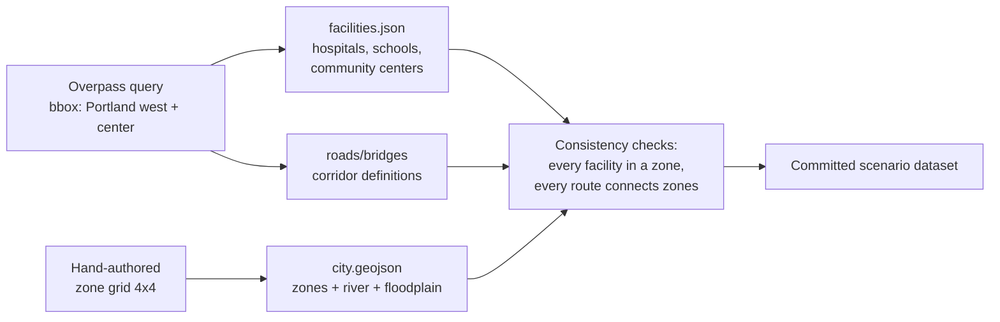
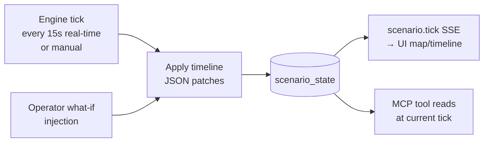

# 06 — Data Strategy

Principle: **real where it's free, keyless, and reliable; seeded-synthetic where real data doesn't exist or would make the demo fragile. Always labeled.**

This document defines the deterministic demo data strategy. The live-product upgrade path is now part of the official plan in `13-live-data-real-app-plan.md`. The two must coexist: demo mode stays replayable, while live operations mode adds provider-backed feeds, provider health, freshness, and source labels.

## 1. Source matrix

| Domain | Source | Real or synthetic | Why |
|---|---|---|---|
| Basemap tiles | OpenFreeMap / Protomaps (MapLibre) | **Real** | Free, keyless, beautiful dark styles |
| Road network + routing | OSM extract + public OSRM demo server (fallback: precomputed routes) | **Real geometry** | Routes drawn on real streets = credibility |
| Weather forecast | Open-Meteo (keyless) primary; NWS API secondary | **Real** (with scenario override) | Live data demo-able; both free, no key |
| Severe weather alerts | NWS alerts API | **Real** (scenario override for demo) | Real alert schema, realistic content |
| Power grid / outages | Seeded synthetic | **Synthetic** | No public real-time feeder data exists; utilities don't publish it |
| Traffic congestion | Seeded synthetic (levels applied to real corridors) | **Synthetic on real geometry** | Live congestion APIs are keyed/paid |
| Facilities (hospitals/schools) | OSM extracts (Overpass, fetched at build time, committed) | **Real locations**, synthetic status | Real POIs on the map; power/capacity status is scenario data |
| Shelters, capacities | Synthetic (placed at real community-center/school POIs) | **Synthetic** | Real capacity data isn't public |
| Population / vulnerability | Synthetic per zone (informed by plausible census-like distributions) | **Synthetic** | Keeps demo city coherent |
| Flood zones | Synthetic polygons along real river geometry | **Synthetic** | FEMA layers are heavy; approximation suffices and is labeled |
| 311 / social signals | Synthetic seeded feed | **Synthetic** | P1 feature |

**Honesty rule (rendered in UI footer, README, and every report):**
> "Map, roads, facilities: real OpenStreetMap data. Weather: live Open-Meteo/NWS when online. Grid, traffic levels, shelters, population: simulated scenario data for a deterministic exercise. No real emergency systems are connected."

**Live-mode honesty rule:**
> "Every displayed value declares its source, provider, timestamp, and freshness. Scenario data is allowed as fallback, but fallback status is visible on the map, in evidence popovers, and in reports."

For the detailed provider matrix, runtime mode model, provider cache, import feeds, frontend wiring, and live-mode evals, see `13-live-data-real-app-plan.md`.

## 2. The demo city build ("Riverbend" over Portland bbox)

Build-time pipeline (`scripts/build-city.ts`, run once, outputs committed to `scenarios/westside-cascade/`):



Committing the outputs means: no network needed at runtime, deterministic forever, and judges can inspect the data.

## 3. Scenario dataset schemas

All files in `scenarios/westside-cascade/`, validated by Zod at load:

**`city.geojson`** — FeatureCollection: 16 zone polygons (`properties: {zoneId, name, population, density, vulnerabilityIndex: {elderlyPct, medDevicePct, nonEnglishPct, mobilityPct}}`), river line, floodplain polygons (`{floodplainId, returnPeriod, activationThresholdMmHr}`), bridge points (`{bridgeId, name, corridorId}`).

**`facilities.json`**
```typescript
{ facilities: Array<{
    id: string; kind: "hospital"|"shelter"|"school"|"substation"|"signal"|"water"|"staging";
    name: string; zone: string; lat: number; lon: number;
    // kind-specific:
    beds?: number; backupGen?: {fuelHours: number};
    capacity?: number; accessible?: boolean; petFriendly?: boolean;
    feeds?: string[];            // substation → zoneIds
    corridorId?: string;         // signal → corridor
}> }
```

**`network.json`** — corridors and candidate routes: `{corridors[]: {id, name, zones[], geo, baseCapacityVph}, routes[]: {id, name, fromZone, toZone, corridorIds[], bridgeIds[], floodplainIds[], baseEtaMin}}`. Routes precomputed via OSRM at build time so runtime routing works offline; `traffic.find_routes` re-ranks these candidates with live scenario congestion.

**`initial-state.json`** — tick-0 values for every mutable entity: outages, congestion per corridor, shelter occupancy, resource unit positions, weather override frames.

**`timeline.json`** — the event table from doc 02 §3: `{events[]: {tick, id, type, patch: JSONPatch[] , announcement}}`. Events are JSON Patches against scenario state — the engine applies them mechanically, no bespoke code per event.

**`whatifs.json`** — same shape, keyed by `WHATIF-*` id, plus `affectedAgents: string[]` (drives selective re-run, doc 07 §5).

**Weather override frames** (inside initial-state): per-tick forecast frames for the storm cell `{tick, perZone: {zone: {precipMmHr, windGust, summary}}}`. In `DEMO_MODE`, `weather.*` tools serve these; otherwise they serve live data and the UI labels the source.

## 4. Adapter design with fallback (in `packages/mcp-server/src/adapters/`)

```typescript
// Every live adapter follows this pattern — demo can never break on network.
async function getForecast(args): Promise<ToolResult<Forecast>> {
  if (env.DEMO_MODE) return scenarioWeather(args);            // deterministic
  try {
    const live = await openMeteo(args, {timeoutMs: 2500});
    return {...live, source: "live"};
  } catch {
    const fb = scenarioWeather(args);
    return {...fb, source: "scenario", note: "live source unavailable, scenario fallback"};
  }
}
```

Adapters: `openMeteo.ts`, `nwsAlerts.ts`, `osrm.ts` (with precomputed-route fallback), `scenarioDb.ts` (SQLite reads). Timeouts short, all responses cached per tick.

## 5. Update loop at runtime



- Live weather (when enabled) is polled every 5 min and stored as a state layer alongside scenario weather; tools report which was used.
- Agents always read through tools at the *current or forked* tick — no agent ever sees future timeline events (prevents oracle leakage; eval-checked).

In live operations mode, this loop is extended by provider pollers and import feeds. The browser still receives server-owned snapshots and SSE updates; it must not call provider APIs directly.

## 6. Seed realism checklist (what makes it "not feel fake")

- Real street names in route descriptions (they come from OSM).
- Customer-outage counts consistent with zone populations (~55% of households).
- Shelter capacities plausible for building types (HS gym 450, church 200).
- Congestion follows rush-hour curves, not random noise.
- Vulnerability indices vary meaningfully across zones and actually change agent outputs (Z-05 drives the transport-assist recommendation).
- Timeline events have realistic operational text ("SCADA reports feeder F-114 lockout") — written once in `timeline.json`, surfaced verbatim in UI and reports.
