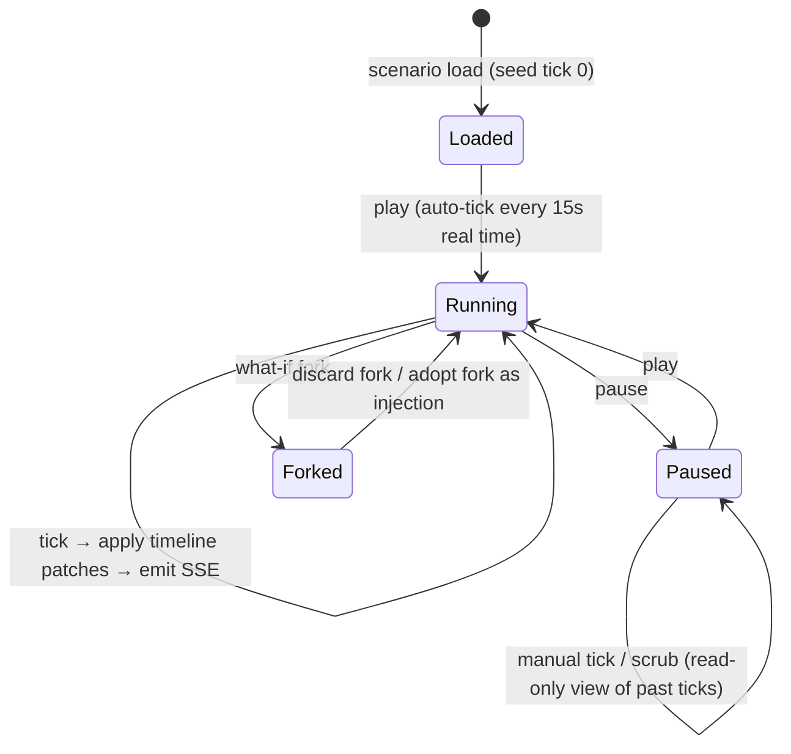
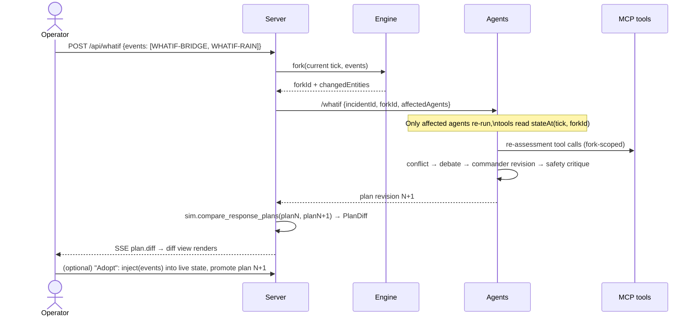

# 07 — Scenario Engine & What-If Simulation

The scenario engine is what makes the demo deterministic, replayable, and cinematic. It lives in `apps/server/src/scenario/`.

## 1. Core model

- **World state** = a bag of entities (`outage`, `corridor`, `shelter`, `facility`, `weatherFrame`, `resourceUnit`, `closure`, `signalGroup`, `report311`) each with a JSON state blob, keyed in `scenario_state` by `(scenarioId, tick, entityType, entityId)`.
- **Tick** = 5 simulated minutes. State at tick N = state at tick N−1 + timeline patches for tick N + any injected patches.
- **Immutability per tick**: past ticks are never rewritten. Rewind = read an earlier tick. This gives free replay and free timeline scrubbing in the UI.



## 2. Engine API (internal + exposed via routes and `sim.*` MCP tools)

| Function | Behavior |
|---|---|
| `load(scenarioId)` | Wipe state for scenario, insert `initial-state.json` as tick 0, reset clock to 17:20 |
| `tick(n=1)` | For each tick: apply matching `timeline.json` patches, recompute derived layers (risk overlay, congestion trends), persist, emit `scenario.tick` + `scenario.event` SSE |
| `inject(eventId)` | Apply a `whatifs.json` patch set to the **live** state at current tick (operator-approved action) |
| `fork(eventIds[])` | Copy current tick state to a fork id, apply patches to the fork only → used by `sim.run_what_if` so agents can analyze hypotheticals without mutating the live demo |
| `stateAt(tick, forkId?)` | Read interface used by all scenario-source MCP tools |
| `replay(scenarioId)` | `load` + scripted tick advance — used by evals for consistency checks |

Derived layers recomputed each tick (pure functions, unit-tested):
- **Risk overlay** (also exposed as `geo.overlay_risk_layers`): per-zone weighted score. Default weights: outage 0.25, flood 0.25, congestion 0.15, vulnerability 0.15, critical-facility exposure 0.15, shelter distance 0.05.
- **Congestion propagation**: dark signals add +0.15 to their corridor; closures push flow to adjacent corridors.
- **Shelter trend**: occupancy drift from timeline patches.

## 3. What-if pipeline (the wow feature)



Key properties:
- **Fork isolation**: the live demo state never changes until the operator adopts. You can run three different what-ifs from the same moment.
- **Selective re-run** (see §5): unaffected agents' findings are carried forward, marked `carriedForward: true` — visible in UI, honest, and halves latency.
- **Explained diff**: the Commander's revision prompt includes plan N and the changed entities, and must output `changeExplanations[] {change, causedBy: eventId, agentFinding}` — this is what the UI narrates.

## 4. PlanDiff schema

```typescript
const PlanDiff = z.object({
  planA: z.string(), planB: z.string(),
  riskDelta: z.object({from: z.number(), to: z.number(), perZone: z.array(z.object({zone: z.string(), from: z.number(), to: z.number()}))}),
  routeChanges: z.array(z.object({purpose: z.string(), from: z.string(), to: z.string(), reason: z.string()})),
  shelterChanges: z.array(z.object({zone: z.string(), fromShelter: z.string(), toShelter: z.string(), reason: z.string()})),
  addedActions: z.array(PlannedAction),
  removedActions: z.array(z.object({action: PlannedAction, reason: z.string()})),
  modifiedActions: z.array(z.object({before: PlannedAction, after: PlannedAction})),
  changeExplanations: z.array(z.object({change: z.string(), causedBy: z.string(), agentFinding: z.string()})),
});
```

The diff computation is deterministic code (match actions by stable semantic keys: `team + timeWindow + target entity`), with the Commander supplying only the `reason`/`changeExplanations` narrative.

## 5. Event → affected-agent mapping (in `whatifs.json`)

| What-if | Re-run | Carried forward |
|---|---|---|
| `WHATIF-BRIDGE` | traffic, shelter (routes drive allocation) | weather, power |
| `WHATIF-RAIN` | weather, traffic, shelter | power |
| `WHATIF-OUTAGE-EAST` | power, shelter | weather, traffic (unless corridor overlap flag) |
| `WHATIF-SHELTER-FULL` | shelter | weather, power, traffic |

Commander + safety + comms always re-run. If an eval shows a carried-forward agent should have changed its finding, fix the mapping — mappings are data, not code.

## 6. Determinism requirements (eval-enforced)

1. `replay()` of the same scenario twice yields byte-identical `scenario_state` (no `Date.now()`, no `Math.random()` without seeded RNG — inject a `rng(seed)` and `clock` into the engine).
2. LLM outputs vary; therefore evals assert on **structured properties** (route id chosen, shelter mapping, risk band, sections present), never exact text.
3. `DEMO_MODE=true` + loaded scenario must produce the full 6-beat demo with network unplugged.
