# 11 — Feature Roadmap & Build Milestones

## 1. Feature roadmap (priority tiers)

| Tier | Feature | Doc | Cuttable? |
|---|---|---|---|
| **P0** | Scenario engine + Westside Cascade dataset | 07, 06 | Never |
| **P0** | MCP server with all safe-tier tools | 05 | Never |
| **P0** | 9-agent ADK pipeline (parallel → debate → critique → plan) | 04 | Never |
| **P0** | Command center dashboard (map, plan, agent room, timeline) | 08 | Never |
| **P0** | Server-driven dashboard + visible source metadata | 13, 03, 08 | Never for live product |
| **P0** | What-if simulation with plan diff | 07 | Never — it's the wow |
| **P0** | Action queue + approval tokens + audit log | 09 | Never |
| **P0** | Incident report generation (markdown) | 04 §3.9 | Never |
| **P0** | Eval suite (deterministic categories minimum) | 10 | Never |
| **P1** | Debate room UI (threaded exchanges) | 08 §3.3 | Degrade to inline conflict cards |
| **P1** | Risk heatmap layer + factor breakdown | 05 (`geo.overlay_risk_layers`) | Degrade to per-zone badge list |
| **P1** | Resource staging optimizer | 05 (`resources.recommend_staging`) | Degrade to rule-based suggestions |
| **P1** | Cascading failure narrative (explicit chain in plan) | 02 §4.5 | Keep — cheap, high value |
| **P1** | 311/social signal ingestion + injection eval | 06, 09 §7 | Cut first |
| **P1** | Judge Mode screen | 08 §3.8 | Cut second (fold into README) |
| **P1** | Live weather integration (non-demo mode) | 13, 06 §4 | Cuttable only for offline demo; required for live product |
| **P2** | Voice command intake | — | Only if ≥1 spare day post-polish |
| **P2** | PDF report export | — | Markdown is enough |

## 2. Team assumption

Plan assumes 2–4 builders (or 1 human + coding agents) and roughly a 10-working-day window. Workstreams are split so frontend and agent work parallelize after M1. If solo: follow milestone order strictly, cut P1s from the bottom of the table.

## 3. Milestones

```mermaid
gantt
    dateFormat  X
    axisFormat Day %s
    section M1 Foundations
    Monorepo, schemas, DB, scenario data, engine, core MCP tools :m1, 0, 2
    section M2 Agent pipeline
    ADK agents, MCP wiring, debate+critique, headless CLI run :m2, 2, 5
    section M3 Command center
    Map, panels, SSE liveness, action queue UI :m3, 4, 7
    section M4 Wow features
    What-if diff, report, evals full, Judge Mode :m4, 7, 9
    section M5 Polish & pitch
    Deploy, video, README, rehearsal :m5, 9, 10
```

### M1 — Foundations (days 1–2)
Build: pnpm monorepo skeleton; `packages/shared` schemas (Finding, Incident, Plan, Action, PlanDiff) + Pydantic generation; SQLite schema; `scripts/build-city.ts` → committed Westside Cascade dataset; scenario engine (load/tick/fork/stateAt/replay); MCP server with scenario-source tools (`grid.*`, `geo.*`, `shelters.*`, `resources.get_available_units`, `sim.*` safe subset); Fastify server with SSE skeleton; CLI `scenario load|tick`.
**Exit criteria:** `crisisgrid scenario load && crisisgrid scenario tick --to 8` replays deterministically; `crisisgrid mcp inspect` lists tools; evals 14 & 15 green.

### M2 — Agent pipeline (days 3–5)
Build: ADK agents (intake → parallel fan-out → conflict detector → debate → commander → safety loop → comms → briefing); MCPToolset wiring; weather/traffic tools + adapters with fallback; `/run` streaming endpoint; action-queue backend with tiers + tokens; audit log; `crisisgrid assess` headless.
**Exit criteria:** headless CLI run on the seeded scenario produces a plan meeting fixture expectations (evals 1–6, 8, 9, 11, 13, 16 green); pipeline ≤ 90s (optimize to 60 later); debate fires on the Route 12 conflict every run.

### M3 — Command center (days 5–7, overlaps M2)
Build: MapLibre map + all layers; top bar + risk gauge; Agent Room with streaming findings, debate threads, tool ticker; Plan panel; Action Queue UI with approve/reject; timeline strip; comms panel with phone-frame preview.
**Exit criteria:** full Beat 1–3 + Beat 5 of the demo runs live in the browser end-to-end; a non-builder can follow what's happening without narration.

### M4 — Wow features (days 7–9)
Build: what-if overlay (fork → selective re-run → PlanDiff view + map ghosting); report generation + download; remaining evals (7, 10, 12, +S) and `crisisgrid evals` reporting; Judge Mode screen; P1s as time allows (in roadmap order).
**Exit criteria:** all 6 demo beats work offline back-to-back; full eval suite green; report is something you'd actually hand a city manager.

### M5 — Polish & pitch (days 9–10)
Build: Docker Compose hardening + Cloud Run deploy + `deploy.sh`; README (writeup structure from doc 03 §10) with real screenshots; `docs/demo-script.md`; security scan in CI; record video per doc 02 §7 (from the deployed instance); 3 full rehearsals, one with network disabled.
**Exit criteria:** a stranger can `docker compose up` from the README in <10 min; video uploaded; submission checklist (below) 100%.

### M6 — Live operations mode (product track)
Build: runtime mode endpoint; provider health endpoint; source metadata shared type; server-owned map snapshot APIs; frontend `EventSource("/api/events")`; real `/api/incidents` runs from the command input; action queue wired to `/api/actions`; Open-Meteo forecast end-to-end; NWS alerts adapter; provider cache; visible freshness/fallback states on every map layer; import pipeline for outages, closures, shelters, and facility status.
**Exit criteria:** the browser no longer treats static scenario JSON as the primary app state; live weather can display as `LIVE` when available; scenario fallback displays as fallback, not truth; every map entity and report row carries source/provider/asOf/freshness metadata.

## 4. Submission checklist

- [ ] Repo public, no secrets in history (scan), `.env.example` complete
- [ ] README = full writeup (goal, architecture + diagrams, setup, agent roles, tools, data honesty, limitations, future work)
- [ ] `docs/`: screenshots, demo script, evals table, security notes
- [ ] Video ≤ 7 min: problem, why agents, architecture, 6-beat demo, Antigravity/build tooling, deploy, security
- [ ] Rubric evidence: ADK multi-agent ✓, MCP server ✓, Antigravity in video ✓, security ✓, deploy shown ✓, CLI shown ✓
- [ ] Deployed URL live and seeded
- [ ] Eval results green and dated within 24h of submission

## 5. Scope-cut ladder (if behind schedule)

Cut in this order for the offline hackathon demo, never the reverse: 311 ingestion → Judge Mode (fold into README) → live weather (scenario-only) → resource optimizer (rule-based) → debate UI threads (inline cards) → 4th what-if events (keep BRIDGE + RAIN). **Never cut:** determinism, approval gates, what-if diff, the report, evals 8/9/14.

For the real product track, do not cut the `13-live-data-real-app-plan.md` L1/L2 work: source metadata, server-driven dashboard state, provider health, and honest fallback labeling are required before adding more cinematic polish.
