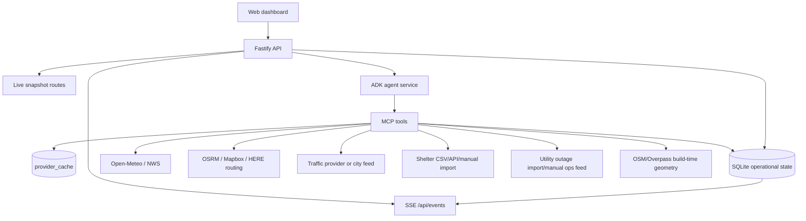

# 13 - Live Data Real-App Plan

This document turns CrisisGrid from a beautiful deterministic scenario demo into a real operational product mode. It does not remove demo mode. It adds a second, honest operating mode where the dashboard, agents, map layers, and reports are driven by provider-backed data with timestamps, source labels, freshness checks, and graceful fallback.

## 1. Current reality

As of the live-app pass, the product has a real server-driven live mode:

| Layer | Current state | Real-time external data? |
|---|---|---|
| Web dashboard | Boots from `/api/map/snapshot`, subscribes to `/api/events`, shows source/freshness/provider truth, and surfaces ops readiness in the source ribbon. | Yes for weather; manual/provider-backed imports for operational layers |
| Server | Exposes runtime, map snapshots, provider health, provider import/refresh, ops health/readiness, incident runs, action approvals, audit, feed, and SSE. | Yes, with provider cache and explicit fallback |
| MCP tools | `weather.get_forecast` uses Open-Meteo when live mode is enabled. | Weather forecast live; other tools remain scenario/manual unless fed by imports |
| Scenario engine | Advances deterministic time and now accepts provider/import patches through `ingest()`. | External/manual provider data can mutate operational state |
| Reports | Can include source metadata from runtime/provider cache and tool records. | Accurate when report generation consumes server/tool source refs |

Conclusion: the app is no longer just a deterministic exercise. It supports live operations mode with live weather, scheduled refresh, validated operational imports, source-labeled map snapshots, and production health endpoints. It still needs deployment-specific provider credentials/adapters for traffic, grid, shelter, and facility systems beyond the generic JSON import feed.

## 1.1 Implemented live spine

- `GET /api/runtime`, `POST /api/runtime/mode`, and `GET /api/providers/health`.
- `GET /api/map/snapshot`, `GET /api/map/layers`, and `GET /api/sources` with per-layer and per-entity source metadata.
- `provider_cache` with source, provider, as-of time, freshness, payload digest, and expiry.
- Live Open-Meteo forecast refresh through the server/provider cache.
- `POST /api/providers/import` for validated grid outage, traffic, closure, shelter, and facility-power data.
- Provider imports mutate scenario state through `ScenarioEngine.ingest()`.
- Provider scheduler with weather refresh and configurable JSON import-feed polling.
- `/api/ops/health`, `/api/ops/readiness`, `/api/ops/liveness`, and `/api/ops/jobs/run`.
- API-key guard for mutating routes when `CRISISGRID_API_KEYS` is configured.
- Dashboard source ribbon shows live/scenario/fallback truth, imported-domain count, ops readiness, and scheduler-job count.

## 2. Product target

CrisisGrid should support two explicit modes:

| Mode | Purpose | Data behavior | UI language |
|---|---|---|---|
| Demo Scenario | Reliable judged demo, offline rehearsal, deterministic evals | Scenario data only; scripted incident timeline | "Demo Scenario - Simulated Exercise" |
| Live Operations | Real app experience for current conditions | Provider-backed feeds where available; synthetic-only domains clearly labeled | "Live Operations" plus per-layer source badges |

The user should never wonder whether a value is real. Every map layer, panel number, finding, action, and report row must carry:

- `source`: `live`, `scenario`, `computed`, `manual`, or `synthetic`
- `provider`: provider name, for example `Open-Meteo`, `NWS`, `OSM`, `OSRM`, `scenario`, `operator`
- `asOf`: wall-clock timestamp for provider data or sim-time for scenario data
- `freshness`: `fresh`, `stale`, `fallback`, or `unknown`
- `confidence`: when the value is inferred or computed

## 3. Non-negotiables

1. Demo mode stays deterministic and offline-capable.
2. The browser never calls provider APIs directly. It talks to the server.
3. Agents never bypass MCP tools. Live provider access happens inside MCP adapters.
4. Every data value shown on the map is source-labeled and timestamped.
5. Fallback is explicit. If weather fails and scenario weather is used, the UI says so.
6. Real-world side effects stay blocked or sandboxed unless a certified integration exists.
7. The map is the primary visual explanation, not decorative background.

## 4. Live data architecture



The main change is not "add API calls to the frontend." The main change is a provider layer plus a normalized operational state model. The frontend subscribes to server state and events.

## 5. Data-source plan by domain

| Domain | Live target | Near-term implementation | Fallback | Notes |
|---|---|---|---|---|
| Basemap | OpenFreeMap/Protomaps/MapLibre tiles | Keep current keyless map plan | Cached or static scenario geometry | Real map tiles are visual context, not operational truth |
| Weather forecast | Open-Meteo | Already partially implemented in MCP; wire to server/UI | Scenario weather | Add provider timestamp and fallback reason |
| Weather alerts | NWS alerts API | Add `nwsAlerts.ts`; expose through `weather.get_alerts` | Scenario alerts | If outside US, use Open-Meteo warnings where available |
| Rain/flood risk | Computed from live forecast + flood polygons | Replace scenario-only rainfall input with live forecast frames when available | Scenario weather frame | Always mark as `computed` with underlying source refs |
| Roads/routes | OSM/OSRM geometry | Keep precomputed OSM route geometry; optionally refresh route ETAs through OSRM | Precomputed routes | Live routing APIs may need keys; isolate behind adapter |
| Traffic congestion | HERE/Mapbox/511/city feed where available | Create adapter interface and start with imported CSV/JSON mock-live feed | Scenario congestion | Do not claim live traffic until a real provider is connected |
| Road closures | City/511 feed or operator import | Add manual/import route for closures | Scenario closures | This is the most realistic non-keyed live feature after weather |
| Power outages | Utility outage map/API if available, otherwise operator import | Add CSV/GeoJSON outage import with schema validation | Scenario outages | Most utility feeds are not public; be honest |
| Hospitals/facilities | OSM/HHS/static official registry where possible | Keep real locations; add manual status updates | Scenario facility status | Location can be real while status is manual/synthetic |
| Shelters | City/county shelter feed or Red Cross-like import if available | Add shelter CSV/API/manual import | Scenario shelters | Capacity/occupancy must be timestamped and source-labeled |
| Population/vulnerability | Census/ACS aggregates | Future build-time import into zones | Scenario synthetic values | Never show individual-level data |
| 311/social | City open-data feed where available | Defer unless source is reliable | Scenario seeded reports | Treat as unverified signals |
| Comms | Sandbox only | Keep sandbox feed | Sandbox feed | No real SMS/broadcast integration for this project |

## 6. Backend changes required

### 6.1 Runtime mode config

Add a server-visible mode object:

```typescript
type RuntimeMode = {
  mode: "demo" | "live";
  scenarioId?: string;
  providers: Record<string, {
    enabled: boolean;
    provider: string;
    lastOkAt?: string;
    lastError?: string;
  }>;
};
```

Expose it through:

- `GET /api/runtime`
- `POST /api/runtime/mode` with operator confirmation
- SSE event `runtime.mode_changed`

### 6.2 Provider cache

Add `provider_cache`:

| Column | Purpose |
|---|---|
| `id` | stable cache key, for example `weather:forecast:Z-05` |
| `domain` | weather, traffic, shelter, outage, facility |
| `provider` | Open-Meteo, NWS, scenario, manual |
| `source` | live, scenario, computed, manual, synthetic |
| `as_of` | provider timestamp |
| `expires_at` | freshness deadline |
| `status` | fresh, stale, fallback, error |
| `payload_json` | normalized provider payload |
| `raw_digest` | hash of raw provider response |

### 6.3 Live snapshot routes

The dashboard needs server-owned snapshots instead of static scenario fetches:

- `GET /api/map/snapshot`
- `GET /api/map/layers`
- `GET /api/sources`
- `GET /api/incidents/:id/evidence`
- `GET /api/providers/health`

Each response must include source metadata. The frontend should not need to infer whether something is live.

### 6.4 Pollers and refresh cadence

Add provider pollers behind the server/MCP layer:

| Feed | Cadence | Failure behavior |
|---|---:|---|
| Weather forecast | 5 minutes | keep last good value, mark stale after 15 minutes |
| Weather alerts | 2 minutes | keep last good value, mark stale after 10 minutes |
| Traffic/closures | 1-2 minutes if provider exists | mark stale quickly |
| Shelter/facility imports | manual or 5 minutes | show last import time |
| Outage imports | manual or provider-defined | show last import time |

Pollers should publish SSE events when normalized state changes.

## 7. MCP tool changes

Keep the existing tool names. Change their internals so they choose the best available source:

| Tool family | Change |
|---|---|
| `weather.*` | Complete Open-Meteo path, add NWS alerts, store source metadata in tool result |
| `traffic.*` | Add live/manual closure adapter; keep congestion synthetic unless a real provider is configured |
| `grid.*` | Add outage import adapter; source can be `manual` or `scenario` |
| `shelters.*` | Add shelter import adapter; capacities can be manual/live with timestamps |
| `geo.*` | Keep scenario/OSM geometry; risk overlay cites the underlying inputs |
| `resources.*` | Keep simulated unless real resource-management integration exists |
| `report.*` | Generate data-source table from actual tool calls and provider cache, not static disclaimers |
| `safety.*` | Add rule: live-mode external action still cannot execute without certified integration and approval |

## 8. Frontend changes required

The dashboard must stop treating the scenario files as the live app state.

Replace:

- static `/scenarios/...` fetches as the primary data source
- scripted browser-only `runAssessmentDemo()` as the main action path
- fake tool-call timers
- SVG-only map state that does not prove provider data

With:

- `GET /api/runtime` on boot
- `GET /api/map/snapshot` for current map state
- one `EventSource("/api/events")` subscription
- `POST /api/incidents` for real assessment runs
- action queue calls to `/api/actions`
- visible source chips on every layer/entity
- map inspector that shows "why am I seeing this?"

### 8.1 Map UX for real comprehension

The map must answer four beginner questions immediately:

1. What is happening?
2. Where is it happening?
3. What is at risk?
4. What should we do next?

Required map layers:

| Layer | Visual | Click inspector must show |
|---|---|---|
| Incident focus | animated boundary and label | incident type, created time, affected zones |
| Risk zones | severity-colored fills | score, factor breakdown, source refs |
| Weather | rain/flood bands | provider, forecast time, fallback status |
| Outages | darkened zones/substation lines | customers affected, provider/import time |
| Routes | recommended solid, rejected dashed | ETA, hazards, why rejected/selected |
| Shelters | capacity rings | occupancy, capacity, source timestamp |
| Facilities | distinct icons | power status, backup/fuel, source |
| Closures | blocked segment markers | reason, start time, source |

### 8.2 UI source language

Use these exact label patterns:

- `LIVE - Open-Meteo - updated 2m ago`
- `COMPUTED - risk score from live weather + scenario floodplain`
- `SCENARIO - deterministic exercise data`
- `MANUAL - operator import - updated 9m ago`
- `FALLBACK - live weather unavailable, using scenario frame`

## 9. Implementation milestones

### L1 - Honest live-mode foundation

- Add `plan/13` to roadmap and README.
- Add runtime mode endpoint.
- Add provider health endpoint.
- Add source metadata type shared across API/tool/frontend.
- Add data-source badges to existing UI even before providers are live.

Exit: the app visibly tells the truth about demo/scenario/computed/live status.

### L2 - Server-driven dashboard

- Replace static frontend boot data with server snapshot APIs.
- Wire `EventSource("/api/events")`.
- Trigger real `/api/incidents` runs from the command input.
- Render actual pipeline events instead of scripted browser timers.
- Wire action queue to real `/api/actions`.

Exit: the dashboard works end-to-end through server/agents/MCP in demo mode.

### L3 - Live weather and alerts

- Finish Open-Meteo forecast integration end-to-end.
- Add NWS alerts adapter.
- Poll/cache weather data.
- Feed live weather into risk overlay.
- Show fallback/freshness in UI and reports.

Exit: a judge can switch to live mode and see real weather provider data on the map.

### L4 - Importable operational feeds

- Add validated CSV/GeoJSON import for outages, closures, shelter status, facility status.
- Add manual operator update UI for status corrections.
- Store imports as `manual` source with timestamps.

Exit: the app can run with real local operations data even when no public API exists.

### L5 - Optional provider integrations

- Add traffic provider adapter if a viable free/keyed source is chosen.
- Add city/county open-data adapters per deployment region.
- Add ACS/Census build-time zone enrichment.

Exit: more layers become provider-backed without changing the UI/agent contracts.

## 10. Evals for live mode

Add these to `10-evaluation-plan.md` when implementation starts:

| Eval | Assertion |
|---|---|
| Source metadata | Every map/entity/tool/report item has source, provider, asOf, freshness |
| Fallback honesty | Forced weather failure displays fallback in UI and report |
| No frontend provider bypass | Browser code does not call Open-Meteo/NWS/traffic providers directly |
| Provider cache | Expired provider data becomes stale and does not display as fresh |
| Live weather path | With `DEMO_MODE=false`, `weather.get_forecast` can return `source: live` |
| Demo determinism preserved | `DEMO_MODE=true` replay remains byte-identical |

## 11. README honesty language

Use this wording until L3-L5 are implemented:

> CrisisGrid currently ships as a deterministic emergency-operations scenario with real map geometry and a live-weather-capable MCP adapter. The visible dashboard is being migrated to server-driven live mode. Weather is the first external live feed; traffic, grid, shelters, facilities, and population are scenario/manual/import-backed unless a deployment config connects real providers. Every value is labeled with source and timestamp.

Once L3 is working:

> CrisisGrid supports demo mode and live operations mode. In live mode, weather and alerts come from live providers when available; operational layers use configured provider feeds or manual imports; scenario data remains an explicit fallback and is always labeled.

## 12. Build order decision

Do not add more visual effects before L1 and L2. The UI cannot feel like a real product while it is disconnected from the server. The next product milestone is:

**Server-driven dashboard with visible data-source truth.**

After that, the breathtaking UI work has something real to dramatize.
